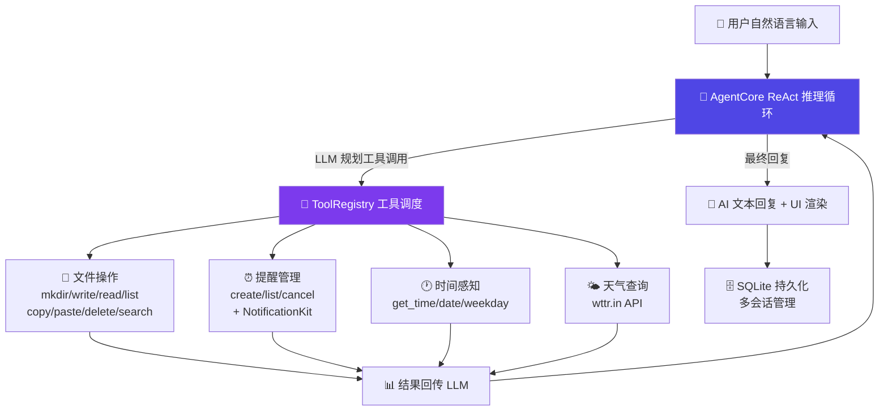

# 2026中国高校计算机大赛——人工智能创意赛
# 鸿蒙赛道作品说明文档（初赛）

参赛学校：河南科技学院 团队名称：Lingxi Flow 作品名称：灵犀流序 赛题方向：Agent创新 联系人（队长）：张科磊 联系电话（队长）：—

---

## 参赛团队信息表

| 项目 | 内容 |
|------|------|
| 作品名称 | 灵犀流序 |
| 团队名称 | Lingxi Flow |
| 参赛学校 | 河南科技学院 |
| 参赛赛题方向 | （ √ ）Agent创新 |

### 团队队员基本信息

| 姓名 | 学校全称 | 院（系）全称 | 专业全称 | 年级 | 毕业时间 | 联系电话 | 邮箱 | 团队分工 |
|------|----------|-------------|----------|------|----------|----------|------|----------|
| 张科磊 | 河南科技学院 | 计算机科学与技术学院 | 计算机科学与技术 | 本科2025级 | 2029.6 | — | —— | 队长：全栈开发、Agent架构设计 |

### 团队指导教师信息

| 姓名 | 院（系）全称 | 职称 | 研究方向 | 联系电话 | 联系邮箱 |
|------|-------------|------|----------|----------|----------|
| 杨威 | 计算机科学与技术学院 | 副教授 | 人工智能、移动应用开发 | — | — |

### 团队成员优势描述

队长张科磊具备完整的鸿蒙原生应用开发经验，独立完成灵犀流序全部架构设计与编码工作。擅长 ArkTS 开发、LLM API 集成、ReAct Agent 推理循环设计，深入研究了 OpenClaw（16 万星开源项目）的 Agent 架构模式和 NanoClaw 的鸿蒙移植方案，在此基础上针对移动端用户场景完成了创新重构。

---

## 作品原创性声明

郑重声明：承诺本参赛队伍报名信息真实有效；呈交的参赛作品相关资料以及所完成的作品实物等相关成果，是本团队独立进行研究工作所取得的成果。作品架构参考了开源项目 OpenClaw 的 ReAct 推理循环范式，并借鉴了 NanoClaw-on-OpenHarmony 项目在鸿蒙平台的工具注册模式，以上项目均为 Apache 2.0 / MIT 开源许可协议授权。在借鉴基础上，灵犀流序面向移动端 AI Agent 场景进行了原创性设计与实现：包括移动端响应式 UI、双主题设计系统、SQLite 多会话持久化、离线关键词兜底等创新功能，所有 ArkTS 代码均为独立开发。除文中已经注明引用的内容外，不包含任何其他个人或集体已经发表或撰写的作品成果，不侵犯任何第三方的知识产权或其他权利。本声明的法律结果由本参赛队承担。

参赛队员签名：____________________ 日期：2026年7月　日

指导老师审核签名：____________________ 日期：2026年7月　日

---

## 一、创意描述

> 一句话生成工作流——AI 自主调用 15 个系统工具，跨文件、提醒、天气多领域完成复杂任务。

---

## 二、设计稿

### 2.1 交互流程图

**设计说明**：用户输入自然语言 → AgentCore 进入 ReAct 循环（Thought-Action-Observation）→ LLM 通过 Function Calling 自主选择 15 个已注册工具中的若干个 → 各工具执行并返回结果 → LLM 根据结果继续推理或生成最终回复 → 全部对话历史存入 SQLite。整个过程对用户透明，仅展示工具调用步骤和最终 AI 回复。

### 2.2 作品效果图

*（附：主页效果图、对话界面效果图、AI 任务执行效果图、文件管理器效果图）*

---

## 三、介绍文档

### 3.1 创意背景

移动端用户常面临"联动操作"的痛点：查天气后写进备忘录、创建文件夹整理文件、设提醒并通知——需要跨多个 App 手动完成 3-5 步操作，耗时且割裂。现有语音助手仅支持单一指令，无法理解上下文、自主规划步骤、串联多个系统工具。

学术界已证明 ReAct（Reasoning + Acting）模式是让 LLM 自主使用工具的有效范式，业界中 OpenClaw（GitHub 16 万星）验证了工具调用编排在 Node.js 生态的可行性，NanoClaw-on-OpenHarmony 项目完成了该模式向 HarmonyOS 的首次移植。然而以上均为命令行/服务端形态，缺少面向普通用户的移动端交互设计。灵犀流序旨在填补这一空白——让 AI Agent 从命令行走向指尖。

### 3.2 核心功能设计

灵犀流序是一个搭载 15 个标准化工具的 AI Agent 应用，通过 OpenAI 兼容 API 接入大语言模型，核心架构包括：

**ReAct 推理引擎（AgentCore）**：最多 15 轮迭代，每轮向 LLM 发送 system prompt + 最近 30 条历史消息 + 20 个工具定义的 JSON Schema。支持 SSE 流式响应，AI 回复边生成边显示。内置 RAG 知识库（RagService）：自动索引沙盒内的记忆笔记与用户文档，每次对话前检索最相关的 top-3 内容块注入 system prompt，让 AI 能基于用户自己的资料回答问题。LLM 返回 finish_reason="tool_calls" 时，引擎遍历每个 tool_call 并调用 ToolRegistry 执行，结果回传 LLM 继续推理；返回 "stop" 时输出最终回复。

**工具系统**：将文件的 8 个操作（mkdir/write_file/read_file/list_files/delete_file/search_files/copy_file/paste_file）、提醒的 3 个操作（create/list/cancel，集成 NotificationKit 系统通知）、时间日期的 3 个操作（get_current_time/date/weekday）、天气查询（wttr.in API）、网页搜索与抓取（web_search/web_fetch，Bing 优先 + DuckDuckGo 兜底）、长期记忆笔记（memory_write/read/list，Markdown 文件存储）、系统日历日程（calendar_create/query，@kit.CalendarKit 读写系统日历）、周期任务（task_create/list/cancel，TaskScheduler 定时执行 AI 任务）共 25 个操作统一注册为标准化 ToolDefinition。LLM 根据用户意图自主选择组合。

**移动端 UI 层**：采用 @State 响应式渲染，AgentEvent 联合类型实时注入 ArkUI。对话页展示消息气泡、工具调用标签和轻量 Markdown 渲染（标题/列表/加粗/行内代码），AI 回复通过 SSE 流式逐字呈现，支持语音输入（SpeechKit 语音转文字）与 AI 回复朗读（TTS 播报），支持多会话管理（新建/重命名/删除/切换）与"删除本轮"；任务页输入目标后 AI 自主规划，步进展板实时显示每步执行状态并附带进度条与耗时统计，完成后可一键重跑；文件管理器与 AI 共享沙盒路径，AI 创建的文件立即可见，并内置文本编辑器。双主题设计（灵犀浅色 / 龙虾深色）通过 AppStorage 全局切换。

### 3.3 创新点

1. **工具蒸馏**：15 个系统工具统一抽象为 JSON Schema 定义，LLM 自主决策调用，不依赖预编排工作流。
2. **移动端 ReAct 架构**：将命令行容器模型改造为 @State 驱动的 ArkUI 响应式架构，工具调用事件实时注入 UI 渲染管线。
3. **沙盒文件路径统一**：AI 工具与文件管理器共享 context.filesDir，AI 操作的文件在文件管理器中实时可见。
4. **离线兜底**：未配置 API Key 时自动降级为关键词意图匹配，保障基本可用。
5. **沉浸式对话体验**：轻量 Markdown 渲染 + SSE 真流式呈现 + 语音输入/TTS 播报 + 多会话管理与"删除本轮"，将命令行式 Agent 交互重构为移动端 IM 体验。
6. **全领域工具覆盖**：在文件/提醒/天气之外扩展网页搜索（适配国内网络的 Bing 优先策略）与长期记忆笔记，让 Agent 具备联网获取信息与跨会话记住用户偏好的能力。
7. **端侧知识库（RAG）**：沙盒内文档自动分块向量化（BGE-M3 嵌入 + 余弦检索，无 Key 时降级关键词匹配），AI 回答基于用户自己的笔记与资料，实现个人专属知识问答。

### 3.4 技术实现

纯 ArkTS 开发，31 个源文件约 8000 行，无任何 JS/TS 桥接。使用 @kit.CoreFileKit（文件 I/O）、@kit.NotificationKit（通知）、@kit.ArkData relationalStore（SQLite）、@kit.NetworkKit（HTTP 调用 + SSE 流式解析）、@kit.CoreSpeechKit（语音识别 + 语音合成）。代码遵循 HarmonyOS 严格 ArkTS 规范（零 any/unknown/Record<>）。

### 3.5 市场前景

Agent 形态的 AI 交互是移动端下一方向。灵犀流序验证了"自然语言→Agent 规划→多工具执行"的端到端链路，已实现系统日历、跨设备协同（设备发现 + 任务进度同步 + 提醒分发，手机输入→手表提醒）等能力，并已提交实况窗（Live View）服务接入申请，让 AI 任务进度与提醒倒计时常驻系统界面。未来可进一步扩展至通讯录、短信等更多系统能力，成为鸿蒙生态中的原生个人助理，在校园场景（课程提醒+材料整理）、办公场景（会议纪要+文件归档）、生活场景（天气简报+出行规划）均有明确落地价值。

---

## 参考资料

1. Yao et al., "ReAct: Synergizing Reasoning and Acting in Language Models", ICLR 2023
2. OpenClaw - https://github.com/anomalyco/openclaw (Apache 2.0)
3. NanoClaw on OpenHarmony - https://github.com/lmxxf/nanoclaw-on-openharmony
4. HarmonyOS 开发者文档 - https://developer.huawei.com/consumer/cn/doc/harmonyos-guides
